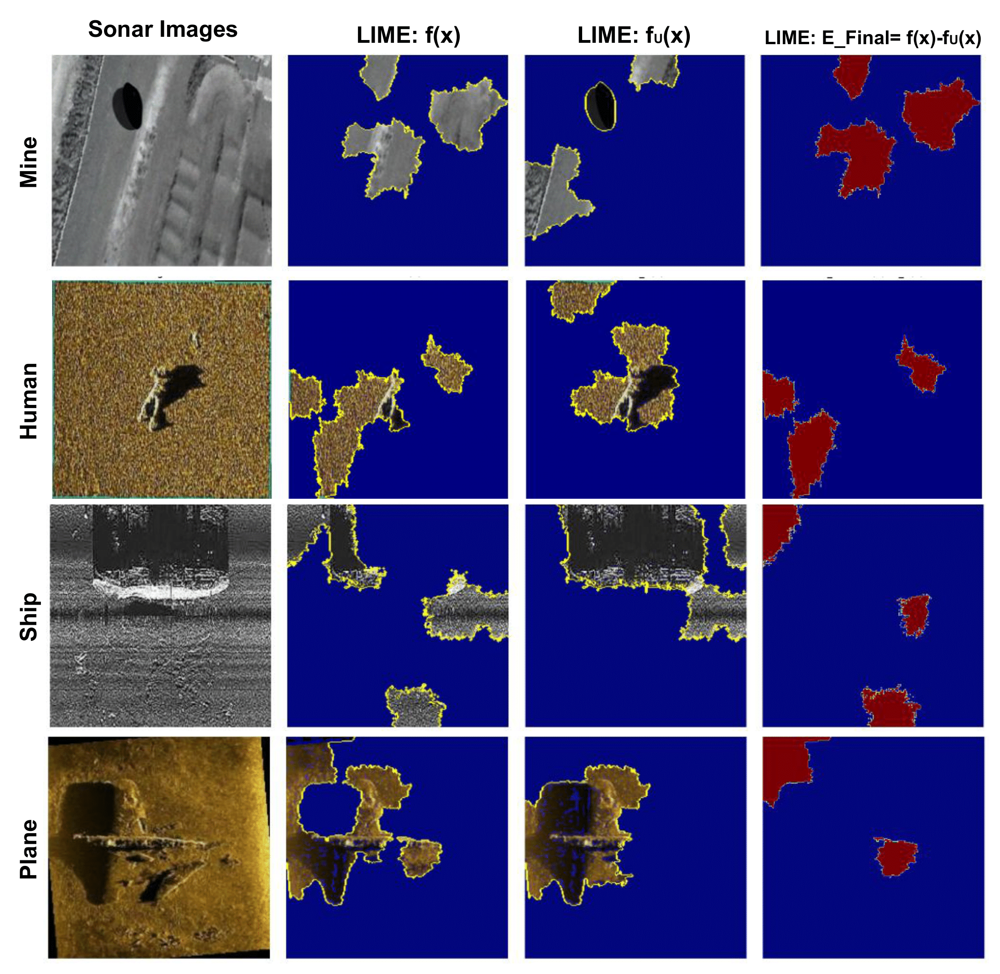

# Supervised Contrastive Machine Unlearning of Background Bias in Sonar Image Classification with Fine-Grained Explainable AI

Official PyTorch implementation of our CVIP 2025 paper:

> **Supervised Contrastive Machine Unlearning of Background Bias in Sonar Image Classification with Fine-Grained Explainable AI**  
> Kamal Basha S, Athira Nambiar  
> SRM Institute of Science and Technology

# Sonar Contrastive Unlearning (TCU + UESF)

<p align="center">
  
</p>

This repository implements:

- **Baseline sonar classifier** using EfficientNet-B0
- **Targeted Contrastive Unlearning (TCU)** with triplet loss (anchor, positive, *seafloor* negative)
- **Unlearn-to-Explain Sonar Framework (UESF)** using LIME-based differential explanations  
- Evaluation on **real + S3Simulator+ synthetic** sonar data (plane, ship, mine, human, seafloor)

---

## 1. Installation

```bash
git clone https://github.com/<your-username>/sonar-contrastive-unlearning-UESF.git
cd sonar-contrastive-unlearning-UESF

python -m venv venv
source venv/bin/activate   # Windows: venv\Scripts\activate

pip install -r requirements.txt
```

## 2. Dataset

Prepare your sonar data in an ImageFolder structure:

```
DATA_ROOT/
    human/
    mine/
    plane/
    ship/
    seafloor/
```
In the paper, we use a combination of SeabedObjects-KLSG, SCTD, and S3Simulator+ datasets.

## 3.Train Baseline Model
```
python -m src.train_baseline \
  --data_dir "PATH/TO/DATA_ROOT" \
  --model_name efficientnet_b0 \
  --batch_size 16 \
  --epochs 20
```

This will:

- Train EfficientNet-B0 with cross-entropy loss
- Save best checkpoint to saved_models/baseline/best_efficientnet_b0.pth
- Save confusion matrix to results/confusion_matrices/baseline_confmat.png

## 4. Train Unlearning Model (TCU)

```
python -m src.train_unlearn \
  --data_dir "PATH/TO/DATA_ROOT" \
  --model_name efficientnet_b0 \
  --batch_size 16 \
  --epochs 20 \
  --lambda_triplet 1.0
```
## 5. Unlearn-to-Explain Sonar Framework (UESF)
```
python -m src.explain_uesf \
  --image_path "PATH/TO/TEST_IMAGE.jpg" \
  --data_dir "PATH/TO/DATA_ROOT" \
  --baseline_ckpt "./saved_models/baseline/best_efficientnet_b0.pth" \
  --unlearned_ckpt "./saved_models/unlearned/model_unlearned_efficientnet_b0.pth" \
  --save_dir "./results/lime"

```

This will save:
  - lime_baseline.png — LIME explanation for baseline model \(f(x)\)  
  - lime_unlearned.png — LIME explanation for unlearned model \(f_u(x)\)  
  - uesf_e_final.png — E_final heatmap, highlighting forgotten (unlearned) background regions

## 6. Citation

```
@inproceedings{basha2025supervised,
  title     = {Supervised Contrastive Machine Unlearning of Background Bias in Sonar Image Classification with Fine-Grained Explainable AI},
  author    = {Kamal Basha S and Athira Nambiar},
  booktitle = {Conference on Computer Vision, Image and Pattern Recognition (CVIP)},
  year      = {2025}
}
```
